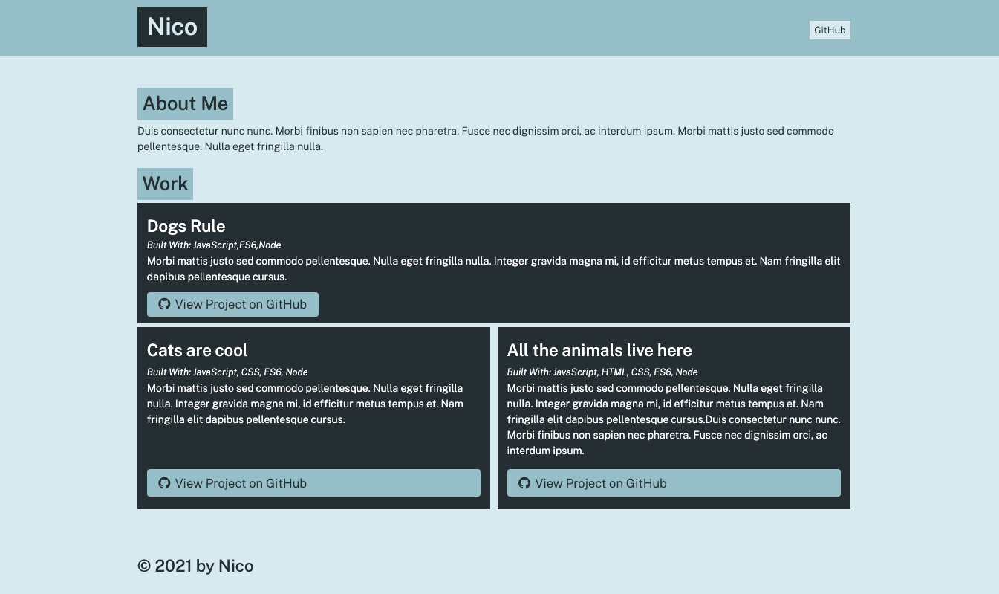

# portfolio-generator

## Description
This is a (Github) portfolio generator that is created for you by simply answering a few questions about yourself and your work. 

## Installation and usage
1. Clone the repo onto your machine
2. On your termnial, navigate to portfolio-generator folder 
3. Enter the command: npm install
4. Answer the questions to be added to your portfolio 

## Contribution
Made with 💚 by Lily Hissong 

Screenshot displaying portfolio example:
